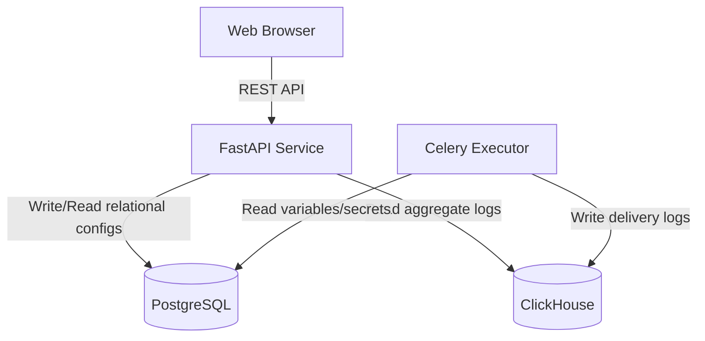

# Production ClickHouse Migration Plan

As the AutoFlow platform scales to millions of workflow runs, the `deliveries` table (the main logs storage) will grow exponentially. In a high-throughput environment, running complex analytical date-range queries, trend-line charts, and search filters on PostgreSQL will degrade database performance. 

This document outlines the production architecture and step-by-step strategy to migrate **Delivery Logs** from PostgreSQL to **ClickHouse**—an open-source column-oriented analytical DBMS.

---

## 1. Hybrid Architecture Overview

We will retain **PostgreSQL** for transactional (OLTP) workspace data while utilizing **ClickHouse** for analytical log tracking (OLAP).



*   **PostgreSQL (OLTP)**: Users, Workspace members, Secrets, Variables, and Workflow templates definitions.
*   **ClickHouse (OLAP)**: Delivery logs, Execution histories, step run outputs, and notification triggers.

---

## 2. ClickHouse Table Schema Design

We will use the **`ReplacingMergeTree`** table engine. This allows us to handle duplicates and updates to execution states (e.g. `executing` -> `delivered` / `failed`) while enabling sub-millisecond query execution on date ranges.

```sql
CREATE TABLE IF NOT EXISTS autoflow.deliveries
(
    id UUID,
    workspace_id UUID,
    workspace_slug LowCardinality(String),
    workflow_id UUID,
    workflow_name String,
    run_id UUID,
    run_number UInt32,
    step_name String,
    channel LowCardinality(String),
    connection_name String,
    recipients Array(String),
    recipient_count UInt16,
    subject String,
    body_format LowCardinality(String),
    attachment_count UInt8,
    status LowCardinality(String),
    detail String,
    provider_refs Array(String),
    started_at DateTime64(3, 'UTC'),
    finished_at DateTime64(3, 'UTC'),
    created_at DateTime64(3, 'UTC') DEFAULT now()
)
ENGINE = ReplacingMergeTree(finished_at)
PRIMARY KEY (workspace_id, channel)
ORDER BY (workspace_id, channel, created_at, id);
```

### Key ClickHouse Optimizations:
1.  **`LowCardinality(String)`**: Used for fields with low distinct values (`status`, `channel`, `body_format`, `workspace_slug`) to reduce storage footprints and speed up aggregation searches.
2.  **`Array(String)`**: ClickHouse natively supports fast array lookups, making querying recipient list indices (like searching for a tester's WhatsApp phone number or email) extremely fast.
3.  **`ORDER BY`**: Configured by `workspace_id`, `channel`, and `created_at` for instant retrieval in dashboard filters and logs exports.

---

## 3. Python Integration Code Example

For ClickHouse integration, use the lightweight asynchronous `clickhouse-connect` or `aiochclient` client library.

### Client Configuration (`app/core/clickhouse.py`):
```python
import clickhouse_connect
from app.core.config import settings

def get_clickhouse_client():
    return clickhouse_connect.get_client(
        host=settings.CLICKHOUSE_HOST,
        port=settings.CLICKHOUSE_PORT,
        username=settings.CLICKHOUSE_USER,
        password=settings.CLICKHOUSE_PASSWORD,
        database=settings.CLICKHOUSE_DB
    )
```

### Inserting Logs (`app/workers/executor.py`):
```python
def insert_delivery_log(delivery_data: dict):
    client = get_clickhouse_client()
    
    # ClickHouse expects a tuple list for bulk insertion
    data = [
        (
            delivery_data["id"],
            delivery_data["workspace_id"],
            delivery_data["workspace_slug"],
            delivery_data["workflow_id"],
            delivery_data["workflow_name"],
            delivery_data["run_id"],
            delivery_data["run_number"],
            delivery_data["step_name"],
            delivery_data["channel"],
            delivery_data["connection_name"],
            delivery_data["recipients"],
            delivery_data["recipient_count"],
            delivery_data["subject"],
            delivery_data["body_format"],
            delivery_data["attachment_count"],
            delivery_data["status"],
            delivery_data["detail"],
            delivery_data["provider_refs"],
            delivery_data["started_at"],
            delivery_data["finished_at"],
            delivery_data["created_at"],
        )
    ]
    
    client.insert("deliveries", data, column_names=[
        "id", "workspace_id", "workspace_slug", "workflow_id", "workflow_name",
        "run_id", "run_number", "step_name", "channel", "connection_name",
        "recipients", "recipient_count", "subject", "body_format", "attachment_count",
        "status", "detail", "provider_refs", "started_at", "finished_at", "created_at"
    ])
```

---

## 4. Gradual Data Migration Strategy

To transition from Postgres delivery logs to ClickHouse in production without downtime:

1.  **Dual Writing (Phase 1)**: Update the FastAPI API and Celery executor to write logs to *both* PostgreSQL and ClickHouse. If ClickHouse write fails, fallback gracefully to log a warning (ensuring system reliability).
2.  **Backfill Script (Phase 2)**: Write a lightweight batch script to extract old delivery records from PostgreSQL and bulk-insert them into ClickHouse in batches of 10,000.
3.  **Read-Redirection (Phase 3)**: Redirect all Dashboard stats APIs (`/dashboard/stats`) and Logs list APIs (`/deliveries`) to read directly from ClickHouse.
4.  **Drop Postgres Table (Phase 4)**: Drop the `deliveries` table columns from PostgreSQL and discontinue dual writing, completely freeing up PostgreSQL memory and performance constraints.
